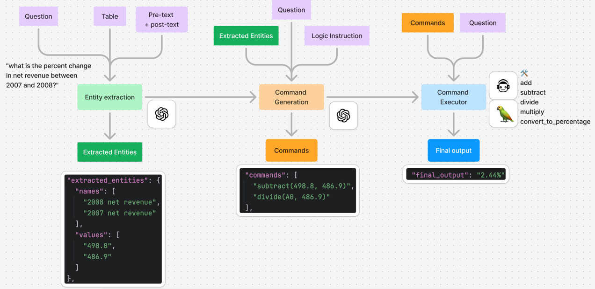
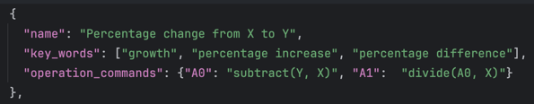
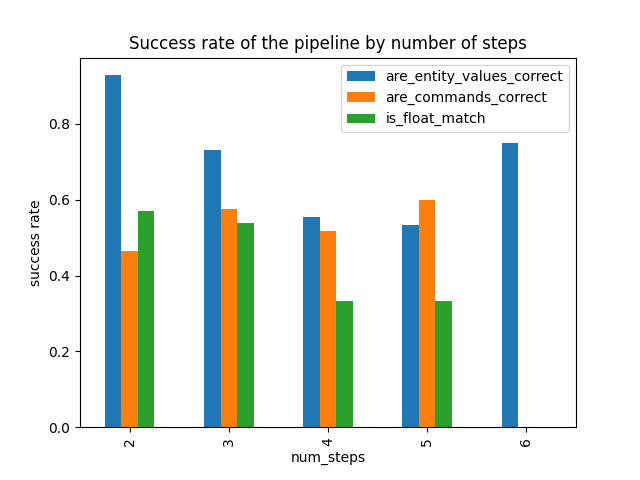

# FinQAFun

## Problem statement
We are building an QA pipeline that can perform simple calculation, in order to answer a question based on a financial table. 

## Dataset understanding
There are 3037 examples in the training dataset. 2109 are type i problems while the rest are type ii (according to the definition in the paper)

This MVP focuses on the type i problems for simplicity. 

## Proposed pipeline

### Step 1. Entity extraction
This step extracts the relevant entities & their values from the table & text for the given question. 

I used the `gpt-4o-2024-08-06` as it reliably produces structured outputs according to the schema. 

### Step 2. Command generation
Given the extracted entities & the question, this step formulates a list of commands in order to calculate the target metric.

In addition, the GPT is provided context on different type of calculation logics, in order to choose the most relevant one according to the question. 

Below is an example of one of the calculation logics: 

The aim is to produce commands that resembles the `step_list` field in the training example. 

### Step 3. Command execution
The list of commands are executed by a Langchain agent powered by `gpt4o`. 

## Evaluation metrics
### Entity extraction accuracy

### Command generation accuracy

### Final output accuracy

## Results

## Discussion

## Improvements
