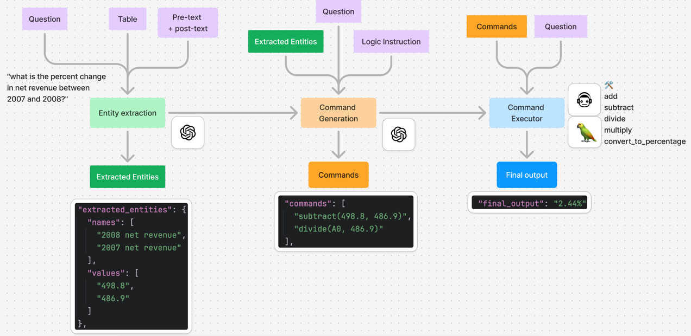
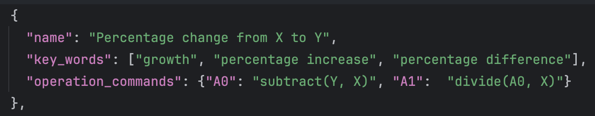
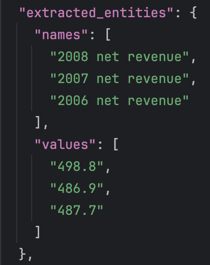
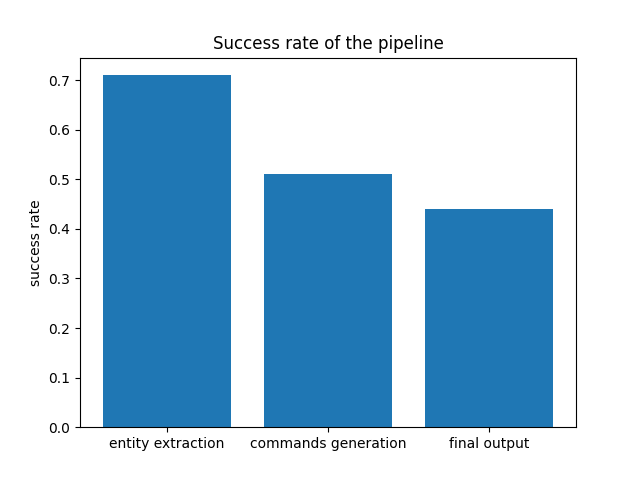
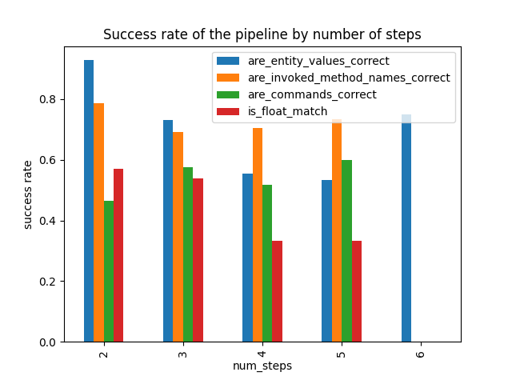

# FinQAFun

## Problem statement
We are building an QA pipeline that can perform simple calculation, in order to answer a question based on a financial table. 

## Instruction on running the project
- `create_dataset/create_data_items.py `- to process the training data into JSONs with a specific format and save them as `data/train_data_items.json`
- `pipeline/run_pipeline.py` - to execute the 3-steps pipeline to generate answers in batch and save the output as `outputs/outputs.json`
- `pipeline/run_inference_on_one_example.py` - to demo the pipeline on one example
- `pipeline/evaluation.py` - to evaluate the outputs against the expected outputs/answers from training data

## Dataset understanding
There are 3037 examples in the training dataset. 2109 are type 1 problems while the rest are type 2 (according to the definition in the paper)

This MVP focuses on the type 1 problems for simplicity. 

## Data processing
Each example is transformed to follow the schema of the `DataItem` class.

## Proposed pipeline
I propose to use a 3-steps pipeline, and they are broken down into extraction, command generation + execution. 

The main benefits of this pipeline: 
- enables us to develop and QA each step independently
- more visibility on the model performance 

### Step 1. Entity extraction
This step extracts the relevant entities & their values from the table & text for the given question. 

I used the `gpt-4o-2024-08-06` as it reliably produces structured outputs according to the schema. 

### Step 2. Command generation
Given the extracted entities & the question, this step formulates a list of commands in order to calculate the target metric.

In addition, the GPT is provided context on different type of calculation logics, in order to choose the most relevant one according to the question. 
This context is configured in `knowledge_base/logic_instruction.json`. 

Below is an example of one of the calculation logics: 

The aim is to produce commands that resembles the format from the `step_list` field in the training data. 
The following is an example of a list of generated commands: 

`    "commands": [
      "subtract(498.8, 486.9)",
      "divide(A0, 486.9)"
    ],
`

### Step 3. Command execution
The list of commands are executed by a Langchain agent. The list of actions are:
- `add`
- `subtract`
- `divide`
- `multiply`
- `convert_to_percentage`

The agent is expected to perform these actions according to the command generated from the previous step. 

The final output is the string representation of float, integer or percentage. 

## Evaluation metrics
### Entity extraction accuracy
The extraction is considered successful if the extracted entities contains all the variables used for the calculation. 
Any additional entities extracted will not be penalised.  

For example, for the question: "what is the percent change in net revenue between 2007 and 2008?", 
and extraction step returns the following:

This is regarded as a successful extraction, even though the net revenue for 2006 is not relevant. 

### Command generation accuracy
The generated commands are evaluated against the step_list. 
Specifically, for a successful command generation we need the following: 
- perfect match of the name of the functions (add/subtract/divide/multiply)
- perfect match of the numerical values between the call arguments

**Limitation**

My current evaluation function does not take care of the following cases:
- A generated command may be one function call for > two arguments, i.e. the generated command can be `add("1", "2", "3")`, while the step list = `[add("1", "2"), add("A0", "3"")]`. Such cases are regarded as mismatch. 
- The call arguments might have a different unit to step list. I.e. a call argument of 1 thousand might be represented as 1000 in the generated command, but it might be 1 in the step list. Such cases are regarded as mismatch. 

### Final output accuracy
This step checks if the numerical value from the final output matches with the answer. 

- The float/integer is extracted from the answer and the final output.
- Obtain the number of decimal places required for the question, based on the float from the expected answer
- Round the generated output with the same decimal place
- Compare the generated output with expected answer with a relative tolerance of `1e-5`. 

**Limitation**
- if the values are correct with reversed signs, it's treated as a mismatch

## Results & Discussion
### % Success rate by pipeline steps
I ran the pipeline based on the first 100 training examples. 

The %success of entity extraction, command generation and final output matching are 71%, 52% and 45% respectively.
(insert misclassification breakdown?)

### % Success rate by the number of steps involved in calculation
Number of steps involved in calculation is used as a metric for question complexity.

**Entity extraction**: 

The success rate generally decreases as the number of steps increases. 

**Invoked correct method names**:
- The correct method names are invoked at around 70% of the time regardless of question complexity.
- The ~30% mismatch is likely to be due to some missing/incorrect context about calculation logics in the knowledge base.

**Command generation**:
- The success rate appears to be around 50% regardless of question complexity or extraction accuracy. 
- Given that we manage to get the method names correct at 70% of the time, the gap is likely due to the values mismatch used in the formula. 
- This implies that the biggest bottleneck is most likely to be entity extraction. 

**Final output accuracy**:

- The success rate generally decreases with increasing complexity. 
- Assuming that command generation %success stays roughly the same, this observation is consistent with my opinion above that improving entity extraction is the most impactful way to lift the overall performance. 

## Improvements
If I have longer on this project, I would: 
- Redesign the entity extraction step with RAG as an agent tool* for accurate value extraction (work in progress)
- Produce more context about the financial calculations in the knowledge base to improve commands generation
- Resolve the known limitations of my evaluation scripts for more accurate metrics
- Some approaches to prevent PII leak (because some financial reports can contain confidential information). I can experiment with offline models such as Llama 3 or replace PII data with a simple language model. 

*Brainstorming for type 2 questions*
- Run pipeline on question 1 using table 1.
- Store all the intermediate inputs from the previous steps, i.e. which entities to extract/RAG queries, commands generated + executed
- Ask GPT to extract the same entities from table 2 (if RAG is used, use the same queries but switch to the table 2 vector index)
- To generate commands for table 2, instruct GPT to replace the table 1 values with new values for table 2 
- Execute the new commands for table 2 and obtain final output for table 2.
