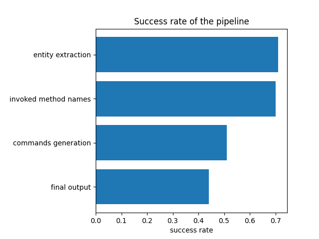

# FinQAFun

## Problem statement
We are building an QA pipeline that can perform simple calculation, in order to answer a question based on a financial table. 

## Dataset understanding
There are 3037 examples in the training dataset. 2109 are type i problems while the rest are type ii (according to the definition in the paper)
This MVP focuses on the type i problems for simplicity. 

## Proposed pipeline

## Evaluation metrics

## Results

## Discussion

## Improvements
